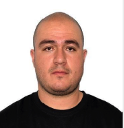

<table>
  <tr>
    <td width="150">
      
    </td>
    <td>
      <h1>Jaime Andrés Henao A.</h1>
      <b>Cloud & DevOps Engineer</b> 
      📠Medellín, Colombia &nbsp;|&nbsp; â˜ï¸ Open to Relocation in EU 
      📧 <a href="mailto:jaimehenao13424@correo.itm.edu.co">jaimehenao13424@correo.itm.edu.co</a> &nbsp;|&nbsp;
      <a href="https://www.linkedin.com/in/jaimehenao8126">LinkedIn</a> &nbsp;|&nbsp;
      <a href="https://jaimehenao2681.wordpress.com">Blog</a>
    </td>
  </tr>
</table>

---

## 🚀 Professional Summary

Cloud and DevOps Engineer with strong hands-on experience in AWS, Terraform, Linux, and Kubernetes. Skilled in automation, infrastructure as code, and continuous delivery pipelines. Passionate about solving technical challenges and driving infrastructure performance and resilience through best practices. Committed to continuous learning and technical excellence.

---

## 🛠️ Technical Skills

* **Cloud Providers:** AWS, Oracle Cloud, Azure
* **Orchestration & Deployment:** Kubernetes (EKS, AKS), Helm, ArgoCD
* **Infrastructure as Code:** Terraform
* **Containers:** Docker
* **CI/CD:** GitHub Actions, Azure DevOps
* **Operating Systems:** Linux (server admin, web/app stack)
* **Networking & Security:** Infrastructure security, patching, vulnerabilities

---

## 💼 Work Experience

### 🌐 GLOBANT – Cloud Engineer / DevOps

📍 Medellín, Colombia | 📅 Feb. 2024 – Present
Part of the Dev Experience Team:

* Kubernetes cluster administration and process automation
* Helm chart creation and GitOps implementation with ArgoCD
* Infrastructure provisioning using Terraform on AWS
* GitHub workflow (Git Flow & trunk-based) management
* CI/CD pipeline operations and developer support

---

### 🔧 PRAGMA – Infrastructure Analyst

📍 Medellín, Colombia | 📅 Mar. 2022 – Feb. 2024

* AWS platform administration (EC2, ECS, Lambda, API Gateway, RDS, VPC)
* Kubernetes and Terraform for infrastructure automation (EKS/AKS)
* Incident handling, patch management, and production support
* Azure DevOps pipeline administration and release management
* Linux systems and database server operations

---

## 🎓 Education

**Networked Computer Systems Administration**
Stucom Study Center – Barcelona, Spain (Jun. 2021)

---

## 📜 Certifications & Courses

* KCNA – Kubernetes and Cloud Native Associate (Jul. 2023 – ACloud Guru)
* Oracle Cloud Foundations Associate (Jul. 2023)
* Kubernetes (Platzi, Jan. 2023)
* AWS Cloud Practitioner (AWS, Dec. 2022)
* DevOps Fundamentals (Platzi, Dec. 2022)
* Azure Fundamentals – ConoSur.Tech (Jul. 2021)
* Google IT Support – Coursera (Jul. 2020)

---

## 🌍 Languages

* Spanish: Native
* English: Intermediate/Advanced (technical & conversational)

---

## 🧠 Core Strengths

* 🔧 Proactive and hands-on
* ✅ Solution-oriented
* 👥 Team collaboration
* 🚀 Self-learner & continuous improver

---

## 📱 Contact Info

📞 +57 316 042 9508
📧 [jaimehenao13424@correo.itm.edu.co](mailto:jaimehenao13424@correo.itm.edu.co)
📧 [arheanja@hotmail.com](mailto:arheanja@hotmail.com)
🔗 [LinkedIn](https://www.linkedin.com/in/jaimehenao8126)
🌐 [Blog](https://jaimehenao2681.wordpress.com)
