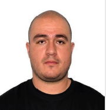

<table>
  <tr>
    <td width="150">
      
    </td>
    <td>
      <h1>Jaime Andrés Henao A.</h1>
      <b>Cloud & DevOps Engineer</b> 
      📍 Medellín, Colombia &nbsp;|&nbsp; ☁️ Open to Relocation in EU 
      📧 <a href="mailto:jaimehenao13424@correo.itm.edu.co">jaimehenao13424@correo.itm.edu.co</a> &nbsp;|&nbsp;
      <a href="https://www.linkedin.com/in/jaimehenao8126">LinkedIn</a> &nbsp;|&nbsp;
      <a href="https://jaimehenao2681.wordpress.com">Blog</a>
    </td>
  </tr>
</table>

---

## 🚀 Perfil Profesional

Cloud Engineer y DevOps con sólida experiencia en AWS, Terraform, Linux y Kubernetes. Especializado en automatización de procesos e implementación de prácticas de entrega continua. Apasionado por los desafíos técnicos y la mejora constante. Fuerte enfoque en infraestructura robusta, eficiente y segura. 

---

## 🛠️ Skills Técnicos

- **Cloud:** AWS, Oracle Cloud, Azure
- **Orquestación:** Kubernetes (EKS, AKS), Helm, ArgoCD
- **IaC:** Terraform
- **Contenedores:** Docker
- **CI/CD:** GitHub Actions, Azure DevOps
- **Sistemas:** Linux, Administración de servidores Web y App
- **Redes:** Networking, Seguridad, Gestión de vulnerabilidades

---

## 💼 Experiencia Profesional

### 🌐 **GLOBANT – Cloud Engineer / DevOps**  
📍 Medellín, Colombia | 📅 Feb. 2024 – Actualidad  
**Equipo Dev Experience:**
- Automatización de procesos, gestión de clústeres Kubernetes
- GitOps con ArgoCD, creación de artefactos Helm
- IaC con Terraform para AWS
- Gestión de workflows en GitHub (git flow & trunk)
- Soporte a equipos de desarrollo y gestión de Pull Requests

---

### 🔧 **PRAGMA – Infrastructure Analyst**  
📍 Medellín, Colombia | 📅 Mar. 2022 – Feb. 2024  
- Administración de AWS (EC2, ECS, Lambdas, API Gateway, RDS, VPC)
- Infraestructura como código con Terraform y Kubernetes (EKS/AKS)
- Administración de servidores Linux, bases de datos y seguridad
- Soporte a producción y gestión de pipelines en Azure DevOps
- Manejo de tickets, releases y resolución de incidentes

---

## 🎓 Formación Académica

**Administrador de Sistemas Informáticos en Red**  
Centro de Estudios Stucom – Barcelona, España (Jun. 2021)

---

## 🧾 Certificaciones & Cursos

- KCNA – Kubernetes and Cloud Native Associate (Jul. 2023 – ACloud Guru)  
- Oracle Cloud Foundations Associate (Jul. 2023)  
- Kubernetes – Platzi (Ene. 2023)  
- AWS Certified Cloud Practitioner (Dic. 2022)  
- DevOps Fundamentals – Platzi (Dic. 2022)  
- Azure Fundamentals – ConoSur.Tech (Jul. 2021)  
- Google IT Support – Coursera (Jul. 2020)

---

## 🗣️ Idiomas

- Español: Nativo  
- Inglés: Intermedio/Avanzado (técnico y profesional)

---

## 🧠 Competencias

- 🔧 Proactivo
- ✅ Resolutivo
- 👥 Trabajo en equipo
- 🚀 Autodidacta

---

## 📱 Contacto

📞 +57 316 042 9508  
📧 jaimehenao13424@correo.itm.edu.co  
📧 arheanja@hotmail.com  
🔗 [LinkedIn](https://www.linkedin.com/in/jaimehenao8126)  
🌐 [Blog](https://jaimehenao2681.wordpress.com)

---
